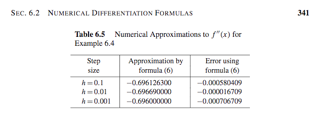
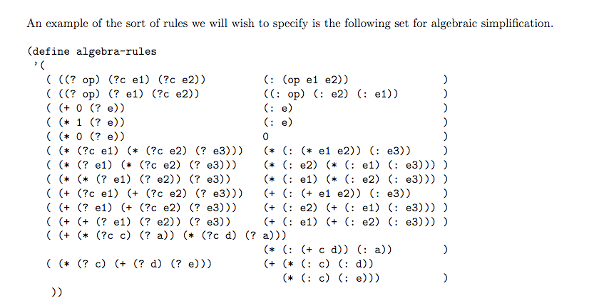
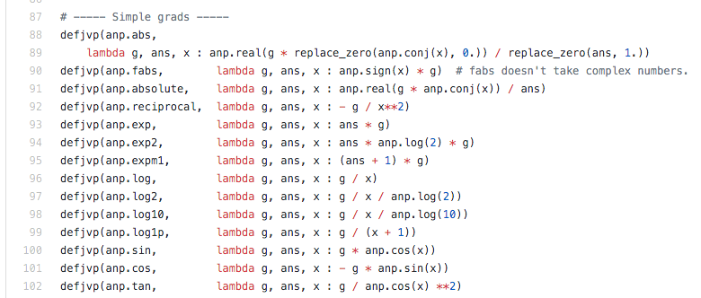

# A brief introduction to PyTorch

## @lpyug 2018-02-13 19:00.

### [Martin Czygan](mailto:martin.czygan@gmail.com) | [pytorch-tour](https://github.com/miku/pytorch-tour)

<!-- TODO: rename to dltour -->

----

## What is Deep Learning?

> Deep learning is a branch of machine learning based on a set of algorithms that attempt to model high-level abstractions in data by using multiple processing layers, with complex structures or otherwise, composed of multiple non-linear transformations.

----

## AI, ML, DL, ...

From: https://blogs.nvidia.com/blog/2016/07/29/whats-difference-artificial-intelligence-machine-learning-deep-learning-ai/

----

## What is Deep Learning?

* some definition: anything with more than two hidden layers
* computationally expensive, high capacity learning machines

----

<!--

## Overhyped?

> I'd say ML is both overhyped and underrated. People overestimate the intelligence and generalization power of ML systems (ML as a magic wand), but underestimate how much can be achieved with relatively crude systems, when applied systematically (ML as the steam power of our era). -- [950604](https://twitter.com/fchollet/status/950604227620950017)

> Deep Learning is under hyped compared to IoT, Big Data, Data Science, ChatBots and Robot Process Automation -- [950691](https://twitter.com/IntuitMachine/status/950691764553252865)

----

-->

## Advances

* AlphaGo (March 2016, Deep Learning and the Game of Go)
* ImageNet classification (2014, VGG16, VGG19)
* Real-Time object detection (2013, darknet; 2016, YOLO)
* Image Captioning
* Neural Style Transfer
* WaveNet (speech generation)
* Speech recognition (2017, [DeepSpeech](https://github.com/mozilla/DeepSpeech))
* Translation (2016, OpenNMT)
* Word Embeddings (2013, word2vec; 2016, fasttext)

----

## And much more

* Image and scene generation
* Image segmentation
* Lip reading
* Text generation
* Time series forecast

----

## A model zoo

* http://www.asimovinstitute.org/wp-content/uploads/2016/09/neuralnetworks.png

----

## History: "A tiny bit of money"

In Nov 2007, Geoffrey Hinton gave a tech talk at Google, called *The Next Generation of Neural Networks*. He seems like a [slightly desperate](https://www.youtube.com/watch?v=AyzOUbkUf3M&feature=youtu.be&t=51m3s).

> We only trained this network once one one data set. If we could get a tiny bit of money from someone we could make this whole thing work much better.

Ten years later Hinton [introduces](https://www.utoronto.ca/news/introducing-vector-institute-ai-research) the Vector Institute at University of Toronto.

----

## Why Now?

* In short: data, cuda, relu.
* Or: availability of data, GPUS, algorithmic advances.

----

## Deep Learning Frameworks

* Abstract away the neural network construction and learning algorithms
* Lots of Python wrappers or pure Python APIs
* [tensorflow](https://www.tensorflow.org/), [keras](https://keras.io/), [mxnet](https://mxnet.incubator.apache.org/api/python/index.html), [pytorch](http://pytorch.org/), [paddle](https://github.com/PaddlePaddle/Paddle), [CNTK](https://www.cntk.ai/pythondocs/),
  [dlib](https://github.com/davisking/dlib), [Theano](http://deeplearning.net/software/theano/), [chainer](https://github.com/chainer/chainer), [dynet](https://github.com/clab/dynet), ...
* Other languages: caffe, caffe2, DL4J, DIGITS

----

## Deep Learning Frameworks

* gpu*
* computational graph*
* automatic differentiation*
* optimization algorithms
* utilities: data loading, dashboard, ...

----

## Parts and Ingredients

Build a **computational graph**, utilize **automatic differentiation**, to adjust the **parameters** of your model according to a given **loss function**, that captures the **distance** between the computed and the expected output, given enough **training data**.

----

## Overview

* basics
* differentiation
* NN
* examples

----

## NumPy performance

* [Notebook #1](https://github.com/miku/pytorch-tour/blob/master/1%20Benchmarks%20(python%20vs%20numpy).ipynb)

----

## PyTorch Basics

It's a Python based scientific computing package targeted at two sets of audiences:

* A replacement for NumPy to use the power of GPUs
* a deep learning research platform that provides maximum flexibility and speed

----

## Basic data structures

* Tensors: like np.ndarray but, GPU-enabled
* [Notebook #2](https://github.com/miku/pytorch-tour/blob/master/2%20Basic%20PyTorch.ipynb)

----

## Automatic Differentiation

> Automatic differentiation (AD) is software to transform code
for one function into code for the derivative of the function.

----

## Gradients

> Imagine you want to test out a new machine learning model for your data. This usually means coming up with some **loss function to capture how well your model fits the data** and **optimizing that loss with respect to the model parameters**.

> If there are many model parameters (neural nets can have millions) then you need **gradients**. You then have two options:
> 
> * derive and code them up yourself, or
> * implement your model using the syntactic and semantic constraints of a system like Theano or TensorFlow.

----

## Automatic Differentiation

Three ways to find the derivative:

* numerical approximation
* symbolic calculation
* AD

----

## Numeric

----

## Symbolic

----

## Automatic

* also called algorithmic differentiation
* there are standalone libraries for this, e.g. autograd

Example with [autograd](https://github.com/HIPS/autograd/blob/master/docs/tutorial.md#how-to-use-autograd): [Notebook #3](https://github.com/miku/pytorch-tour/blob/master/3%20Autograd.ipynb)

----

## Automatic

> To compute the gradient, Autograd first has to record every transformation that was applied to the input as it was turned into the output of your function. To do this, Autograd wraps functions (using the function primitive) so that when they're called, they add themselves to a list of operations performed. Autograd's core has a table mapping these wrapped primitives to their corresponding gradient functions.

----

## Automatic

----

## Autograd in PyTorch

> The autograd package provides automatic differentiation for all operations on Tensors.

* [Notebook #3](https://github.com/miku/pytorch-tour/blob/master/3%20Autograd.ipynb)

----

## Simple MLP

* [Notebook #4](https://github.com/miku/pytorch-tour/blob/master/4%20Basic%20MLP.ipynb)

----

## CIFAR10 Example

* [Notebook #5](https://github.com/miku/pytorch-tour/blob/master/5%20CIFAR10.ipynb)

----

...
